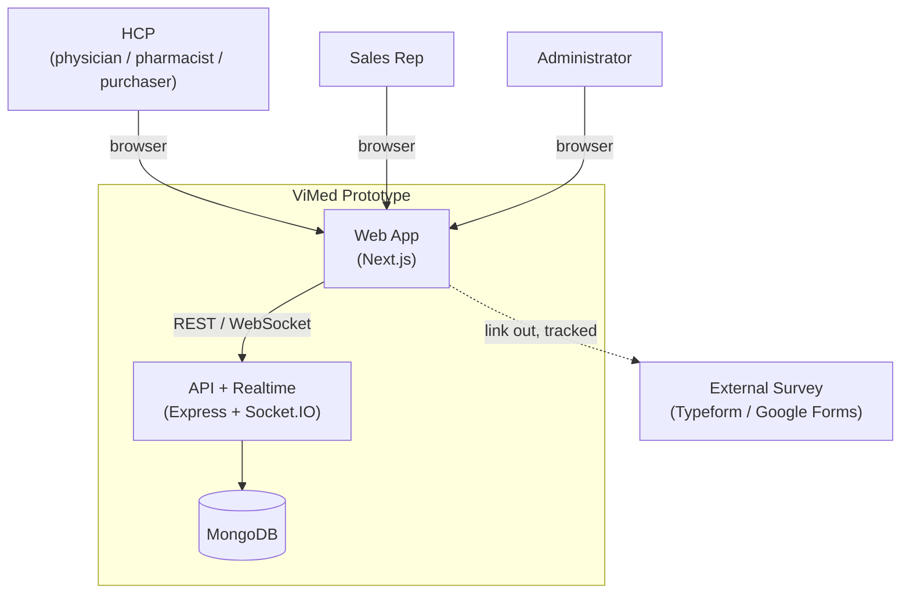
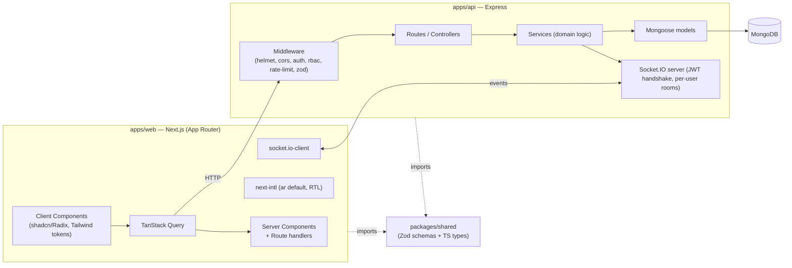
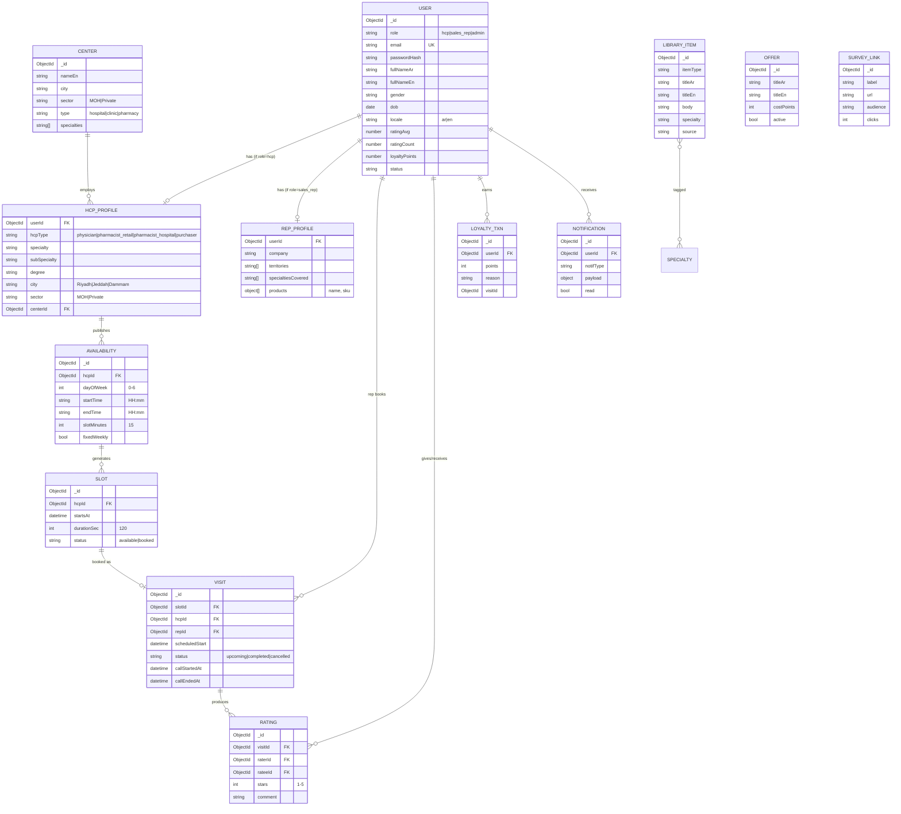
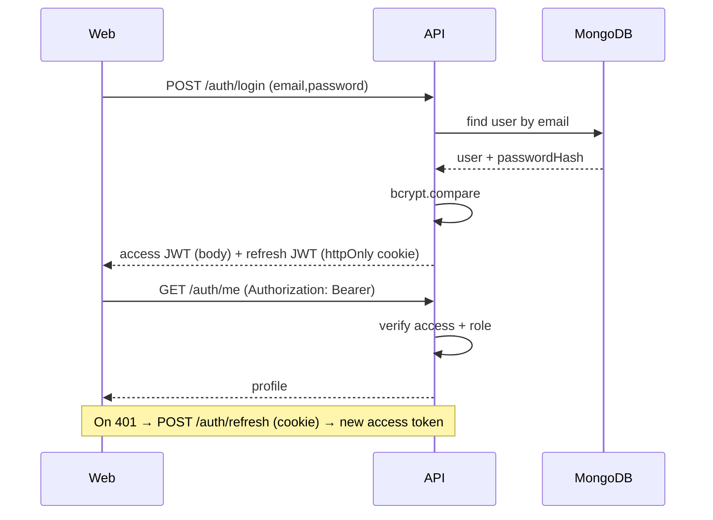
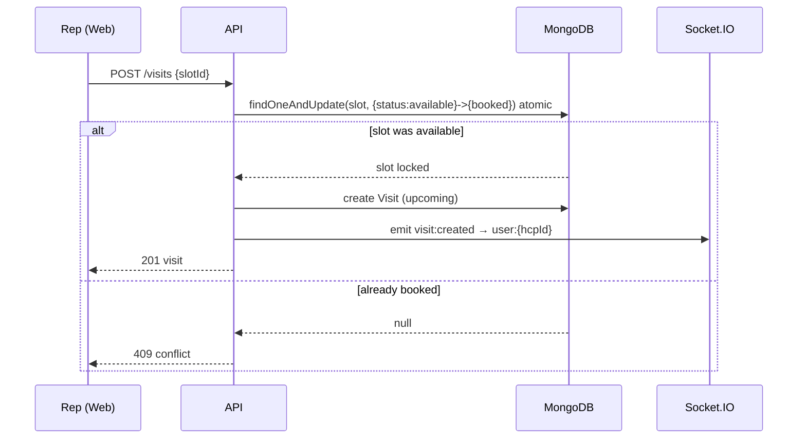
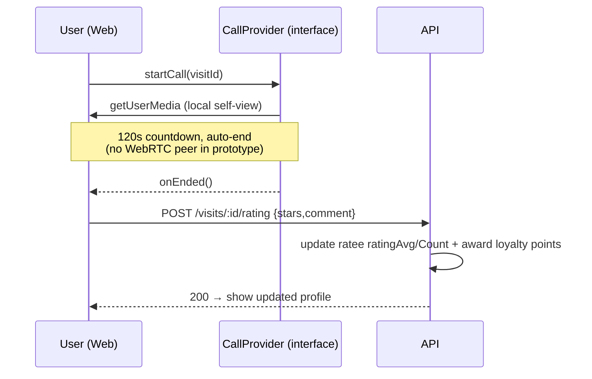

# ViMed — Architecture &amp; Decisions

> **Audience:** Software architect / senior engineer.
> **Purpose:** The reasoning layer behind the ViMed web prototype — structure, data, contracts, flows, non-functionals, and the decisions (with trade-offs) that shape them.
> **Companions:** `ViMed_Project_Compass.pdf` (business) · `ViMed_Build_Plan.md` (executable steps).

---

## 1. Context & goals

ViMed connects **HCPs** (physicians, pharmacists, purchasers) with **pharma sales reps** via scheduled **120-second** calls, plus a library, loyalty layer, and admin analytics. This artefact is a **feedback prototype** for the **Saudi** market, built on **Next.js + Express + MongoDB**.

**Architectural north stars**
- **Maintainable** — clear module boundaries, single source of truth for types, no copy-paste between client/server.
- **Scalable** — stateless API, horizontally scalable, DB-backed; realtime via rooms.
- **Flexible** — every "prototype shortcut" (simulated call, mock content, local infra) sits behind a seam so it upgrades without a rewrite.

### Non-functional requirements (prototype-appropriate, production-aware)
| NFR | Prototype stance |
|---|---|
| Security | JWT auth, RBAC on every endpoint, input validation, helmet/cors/rate-limit, hashed passwords, httpOnly refresh cookie. |
| i18n / RTL | Arabic-default bilingual; layout mirrored via logical properties; locale-prefixed routes. |
| Performance | Mobile-first payloads, indexed queries, paginated lists, cached server state. |
| Scalability | Stateless API + Socket.IO with an adapter-ready design (Redis later). |
| Maintainability | Strict TS, shared Zod/types package, layered backend, design-token UI. |
| Observability | Structured logging (pino); request IDs; health endpoint. |
| Testability | Pure domain logic, Zod contracts, Vitest/Supertest seams. |

---

## 2. System context (C4 — Level 1)



---

## 3. Container architecture (C4 — Level 2)



**Why a separate Express API (not Next route handlers only):** explicit per the brief, and it earns its keep here — the API hosts the **Socket.IO** server and a long-lived realtime layer, can scale independently of the web tier, and keeps a clean client/server boundary. See ADR-002.

---

## 4. Monorepo structure & rationale

```
vimed/
├─ apps/web        # presentation + BFF-ish server components
├─ apps/api        # REST + realtime + domain + persistence
├─ packages/shared # Zod schemas + inferred types (ONE source of truth)
├─ packages/config # tsconfig / eslint / prettier
└─ packages/i18n   # ar/en message catalogues
```
- **Shared contracts** kill client/server drift: the same Zod schema validates an API body and types the React form.
- **Turborepo** caches `build/lint/typecheck/test` and runs `dev` for both apps together.
- **pnpm workspaces** give fast, disk-efficient, strict dependency resolution.

---

## 5. Data model (ERD)



**Indexing notes:** `User.email` (unique); `HCP_PROFILE` compound on `{city, sector, specialty, centerId}` for directory filters; `SLOT {hcpId, startsAt, status}`; `VISIT {hcpId, status}` and `{repId, status}`; text index on names/center for search.

---

## 6. API surface (representative)

| Method | Path | Role | Purpose |
|---|---|---|---|
| POST | `/api/auth/register` | public | Role-specific sign-up |
| POST | `/api/auth/login` | public | Email+password → JWTs |
| POST | `/api/auth/refresh` | cookie | Rotate access token |
| GET | `/api/auth/me` | any | Current session |
| GET | `/api/directory` | rep | Filter+search HCPs |
| GET | `/api/hcp/:id` | rep | Profile + open slots |
| GET/PUT | `/api/availability` | hcp | Author weekly availability |
| GET | `/api/availability/me` | hcp | Own slots/calendar |
| POST | `/api/visits` | rep | Book a slot |
| GET | `/api/visits` | hcp,rep | Upcoming / history |
| PATCH | `/api/visits/:id` | rep | Reschedule / cancel |
| POST | `/api/visits/:id/rating` | hcp,rep | Post-call rating |
| GET | `/api/library` | any | Updates / protocols |
| GET | `/api/loyalty/me` | any | Points + history |
| GET | `/api/loyalty/leaderboard` | any | Rankings |
| GET | `/api/admin/metrics` | admin | KPI dashboard data |
| GET/POST | `/api/admin/survey-links` | admin | Manage survey links |
| POST | `/api/feedback/click` | any | Track survey click |

**WebSocket events (Socket.IO, JWT handshake, per-user room `user:{id}`)**
`visit:created` · `visit:updated` · `visit:reminder` · `notification:new` · `leaderboard:updated`.

---

## 7. Key sequence flows

### 7.1 Auth (JWT, access + refresh)


### 7.2 Booking a visit (race-safe)


### 7.3 Simulated call → rating


---

## 8. Frontend architecture

- **App Router** with route groups: `(public)` (auth), `(app)` (authenticated shell), `(admin)`. Locale segment `[locale]` wraps everything (`/[locale]/(app)/visits`).
- **App shell:** mobile-first bottom navigation that becomes a desktop side rail; the center action is role-dependent (rep → New Visit, HCP → Availability).
- **Rendering strategy:** Server Components for data-backed pages (auth-checked server-side); Client Components for interactivity (forms, calendar, call room, realtime). TanStack Query owns server-state cache; Zustand holds only ephemeral UI/session state.
- **i18n/RTL:** next-intl, `defaultLocale: 'ar'`; `dir` derived from locale; **CSS logical properties** + Tailwind logical utilities so a single layout serves both directions. Fonts split by script (Arabic vs Latin) via `next/font`.
- **Design system:** Soft Care tokens as CSS variables → Tailwind theme → shadcn components. No raw hex in components, ever.

---

## 9. Backend architecture

Layered, dependency flows downward only:
```
routes -> controllers -> services (domain) -> models (mongoose) -> MongoDB
                          \--> emits --> Socket.IO
```
- **Validation at the edge:** Zod (from `packages/shared`) parses every request body/query.
- **Auth middleware:** `requireAuth` (verify JWT) + `requireRole(...)`.
- **Services hold domain logic** (slot generation, booking atomicity, rating + loyalty), keeping controllers thin and logic unit-testable.
- **Realtime:** Socket.IO authenticated by JWT on handshake; services emit to `user:{id}` rooms. Adapter-pluggable (in-memory now → Redis adapter for multi-instance later).

---

## 10. Cross-cutting concerns

- **Security:** bcrypt hashing; short access TTL + rotating refresh in httpOnly cookie; RBAC on every route; helmet; CORS pinned to `CLIENT_URL`; rate limiting on auth & write routes; Zod validation everywhere; no secrets in code.
- **i18n strategy:** message catalogues are the single source of UI strings; data carries `*_ar`/`*_en` where bilingual (names Arabic, centres/cities English per the brief).
- **Error handling:** typed error classes → central Express error middleware → consistent JSON shape `{ error: { code, message } }`; client surfaces via toasts.
- **Observability:** pino structured logs + request IDs; `/api/health` for liveness.
- **Testing:** Vitest for service/domain units; Supertest for API contracts; a few Playwright happy-path e2e (auth, book, rate) optional.

---

## 11. Architecture Decision Records (with trade-offs)

**ADR-001 — pnpm + Turborepo monorepo.**
*Decision:* one repo, shared `packages/shared`. *Why:* eliminates type drift, single install, cached tasks, clean Claude Code handoff. *Trade-off:* slightly more initial setup vs two repos; mitigated by scaffolding in Phase 0.

**ADR-002 — Separate Express API + Socket.IO (vs Next-only).**
*Decision:* dedicated API service. *Why:* required by brief; hosts persistent realtime layer; scales independently; clean boundary. *Trade-off:* two processes to run/deploy; acceptable and managed by Turbo locally.

**ADR-003 — JWT (access + refresh) auth.**
*Decision:* stateless access JWT + httpOnly refresh cookie. *Why:* stateless API scales horizontally; matches "real auth, seeded demo accounts" requirement; OTP explicitly dropped. *Trade-off:* token revocation is coarse; fine for a prototype (add a refresh-token store/blocklist in production).

**ADR-004 — Simulated video call behind a `CallProvider` interface.**
*Decision:* local-camera + 120s countdown, no WebRTC. *Why:* validates the *flow and reaction* at zero telephony cost/complexity — the prototype's actual goal. *Trade-off:* not a real call; the interface seam makes swapping in LiveKit/Daily/Agora a contained change.

**ADR-005 — MongoDB + Mongoose.**
*Decision:* document store. *Why:* flexible evolving schema during a prototype; natural fit for profiles/availability/visits; fast local setup via Docker. *Trade-off:* fewer relational guarantees — addressed with atomic `findOneAndUpdate` for booking and explicit indexes.

**ADR-006 — User base + profile collections.**
*Decision:* single `User` (auth + shared fields) with separate `HcpProfile`/`RepProfile` keyed by `userId` (or Mongoose discriminators). *Why:* clean role separation, lean auth doc, easy role-specific validation. *Trade-off:* an extra lookup for full profile; mitigated by population/indexing.

**ADR-007 — next-intl + CSS logical properties for Arabic-default RTL.**
*Decision:* locale-prefixed routes, `ar` default, logical CSS. *Why:* one layout serves both directions; correct mirroring, not just translation; credible for KSA. *Trade-off:* discipline required (no `left/right`); enforced by lint/review.

**ADR-008 — TanStack Query for server state, Zustand for UI state.**
*Decision:* split responsibilities. *Why:* caching/refetch/realtime-merge handled by Query; Zustand stays tiny. *Trade-off:* two state tools; clear boundary keeps it simple.

**ADR-009 — Admin dashboard + external survey links as the feedback engine.**
*Decision:* instrument ratings, expose admin analytics, track survey click-throughs. *Why:* the prototype exists to learn; this turns usage into evidence. *Trade-off:* analytics are simple aggregates (not a data warehouse) — sufficient at this stage.

**ADR-010 — Local/dev only for now.**
*Decision:* Docker Mongo + local processes; reserve cloud env names. *Why:* fastest iteration for testing. *Trade-off:* a deploy step deferred; env design already cloud-ready (Atlas URI, secrets) so promotion is config-only.

---

## 12. Prototype → production evolution path

| Seam | Prototype | Production upgrade (contained change) |
|---|---|---|
| Video | `CallProvider` (simulated) | Real WebRTC (LiveKit/Daily/Agora) behind same interface |
| Auth | email+password JWT | + phone/OTP, email verification, refresh-token store |
| Realtime | in-memory Socket.IO | Redis adapter for multi-instance scale-out |
| Infra | Docker Mongo + local | MongoDB Atlas + Vercel (web) + Render/Railway (api) |
| Content | mock library | curated/licensed guideline feeds |
| Loyalty | demo points/offers | real reward partners + redemption |
| Territory | city→centre dropdowns | map-based territory drawing + geolocation |
| Feedback | admin aggregates + survey links | embedded research instrumentation / warehouse |

The guiding rule: **prototype shortcuts are isolated behind interfaces and config**, so production is an *upgrade path*, never a rewrite.
